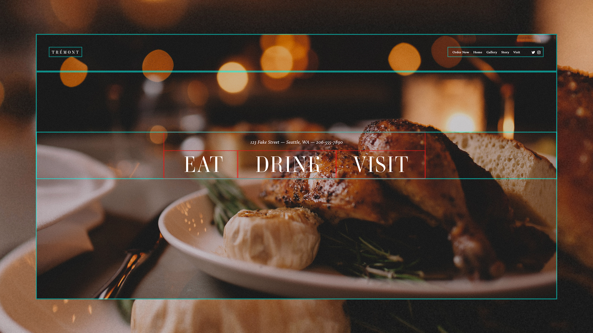

# Procesverslag
**Auteur:** First Wongsrila

Markdown cheat cheet: [Hulp bij het schrijven van Markdown](https://github.com/adam-p/markdown-here/wiki/Markdown-Cheatsheet). Nb. de standaardstructuur en de spartaanse opmaak zijn helemaal prima. Het gaat om de inhoud van je procesverslag. Besteedt de tijd voor pracht en praal aan je website.

## Bronnenlijst
1. https://tremont-demo.squarespace.com/

## Eindgesprek (week 7/8)

-dit ging goed & dit was lastig-

**Screenshot(s):**

-screenshot(s) van je eindresultaat-

## Voortgang 3 (week 6)

-same as voortgang 1-

## Voortgang 2 (week 5)

-same as voortgang 1-

## Voortgang 1 (week 3)

### Stand van zaken

Ik was bezig met het menu pagina. Ik wilde dit gaan stylen met flexbox. Al snel werd dit lastig op het ook responsive te maken omdat de website een 3 column grid had. Daarom begon ik research te doen naar "display: grid". Ook ging ik kijken hoe je met GRID een responsive website kan coderen/stylen. Uiteindelijk is het mij gelukt om de hele pagina de coderen die ook responsive is. Alleen de navigatie moet ik coderen. Ik moet nog iets meer onderzoek doen naar hoe je een responsive hamburger menu kan maken. Ook wil ik gaan kijken wat mijn alternatieven zijn voor de hamburger menu. 

**Screenshot(s):**

-screenshot(s) van hoe ver je bent-

### Agenda voor meeting

1. Vragen hoe je een responsive website maakt
2. Technische vragen over hoe je een functie moet coderen/stylen.

### Verslag van meeting

Tijdens de meeting heb ik handige tips gekregen over de vragen die wij als groepje hadden. Ik heb ook tips en verbeterpunten gekregen over mijn code.

## Intake (week 1)

**Je startniveau:** Rood

**Je focus:** Responsive

**Je opdracht:** https://tremont-demo.squarespace.com/

**Screenshot(s):**

en

**Breakdown-schets(en):**

